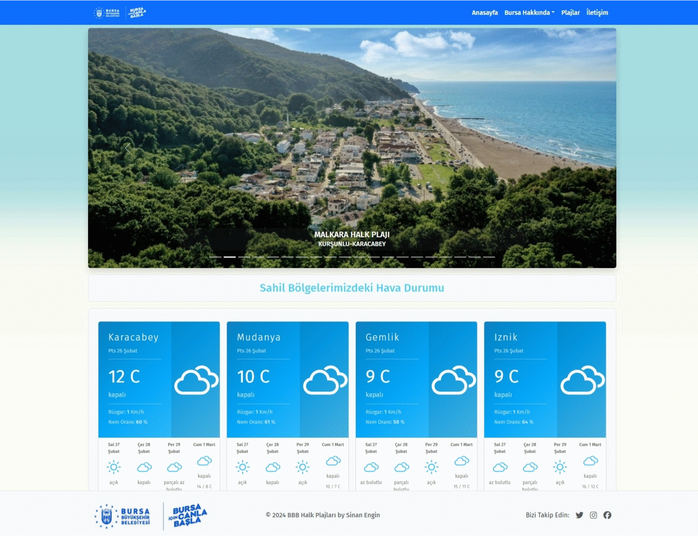

# Bursa Plajları Sitesi

Bu projede code16 akademisi boyunca öğrendiğim tüm bilgileri kullanma fırsatı buldum.  
Axios kullanılarak Açık Şehir Bursa apisi ile veriler çekildi. 
Google Fonts ve Font Awesome apileri ile özel font ve iconlar kullanıldı. 
React Bootstrap ile stillendirme yapıldı. 
React Router Dom ile navigasyon yapıldı. 
React Weather ile bölgeye göre hava durumu bilgileri eklendi.  
Google Maps Api ile plajların konumları gösterildi.
Vercel Sayfası=> [Bursa Plajları](https://bursaplajlari.vercel.app/).

